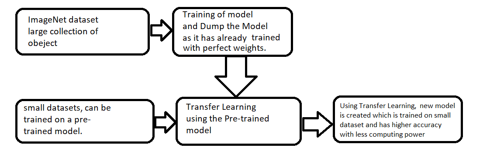

# Face Recognizer using Transfer Learning
## Using Keras and VGG16(pre-trained model already trained on ImageNet dataset) used for transfer learning.

Pre-requisites- 
1. Install Anaconda Python Distribution. 
2. Install various python libraries
`# pip install -r requirements.txt`
4. Run command prompt,
`> jupyter notebok`
### Step 1
Clone the repo `# git clone https://github.com/A4ANK/face_recognition_Transfer_Learning.git`
In repo directory, create two sub directories 
`# mkdir train` 
`# mkdir test` 
Similarly, also create subdirectories inside test and train directories for subcategories that you want to predict, respectively.
Now, collect dataset using face_extractor.ipynb notebook

### Step 2
Load the VGG16 pre-trained model inside Transfer Learning.ipynb
Use transfer learning to train this pre-trained model on the new smaller dataset created using face_extractor.ipynb notebook.

### Step 3
Run Real Time Face recognizer.ipynb notebook to perform.

